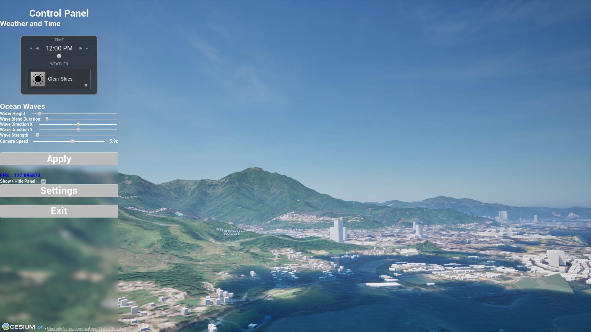
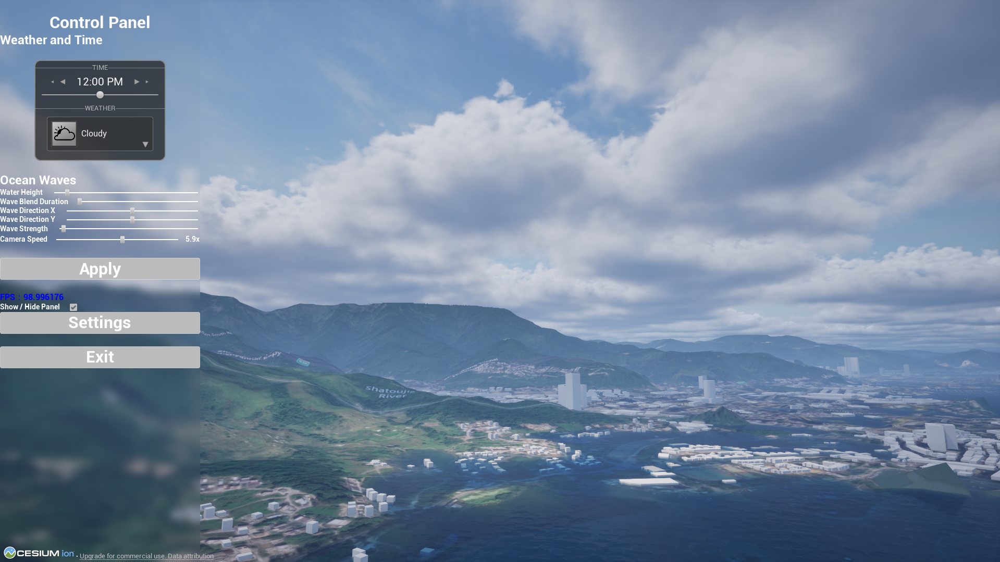
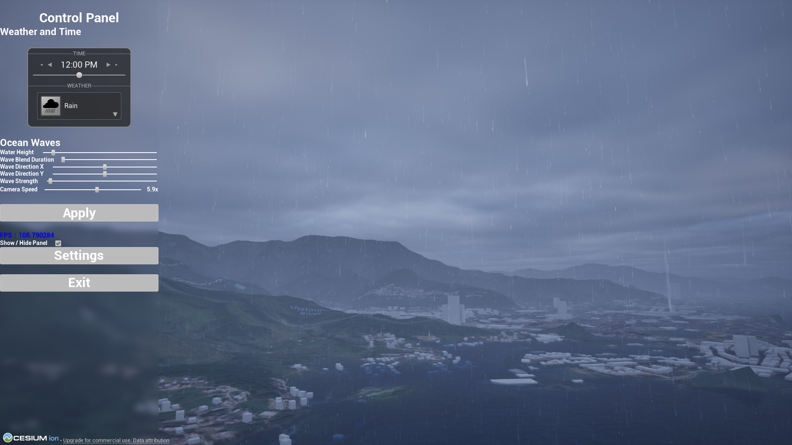
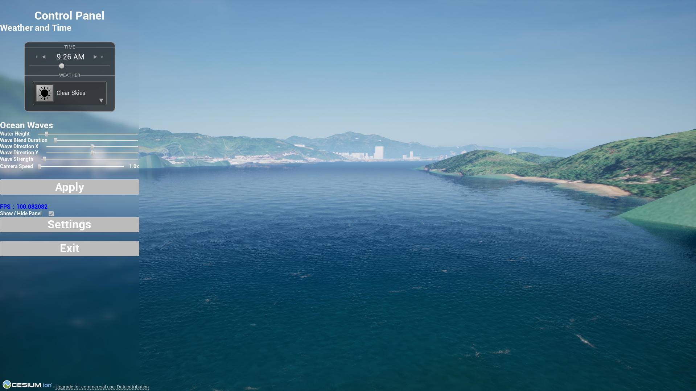
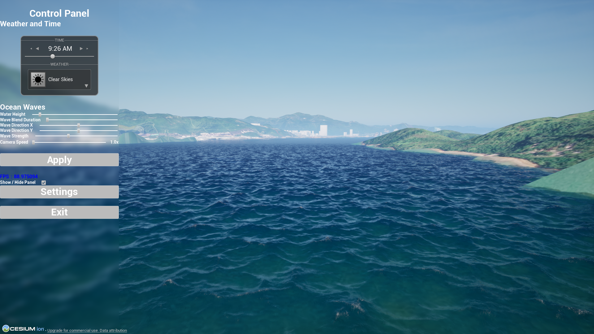
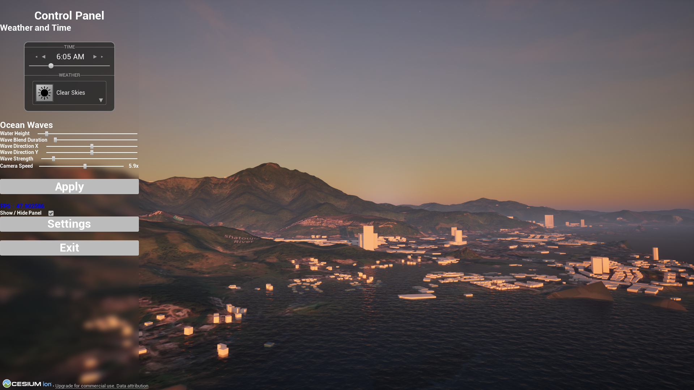
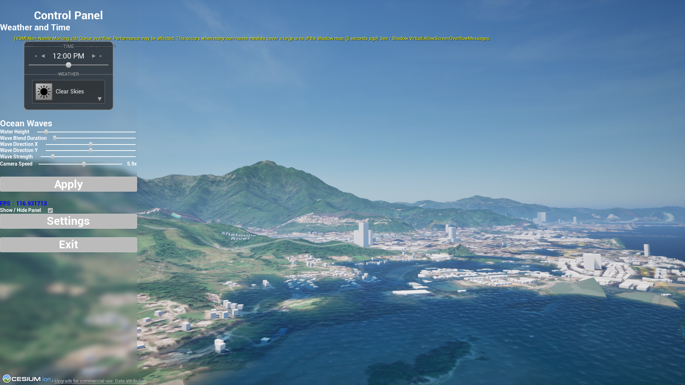
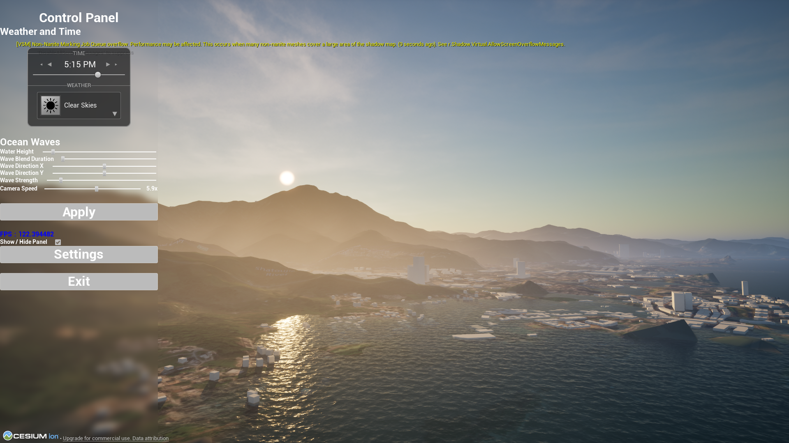
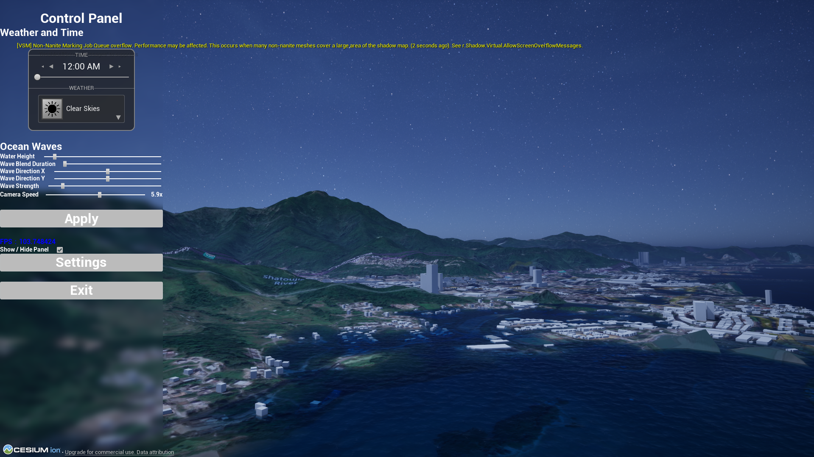

# Real-Time Water & Weather Simulation | UE5

An interactive Unreal Engine 5.6 visualization prototype for exploring how changing weather, time of day, and ocean-wave parameters affect the appearance of a coastal scene. The project combines a fly-through camera, an on-screen control panel, dynamic sky and weather, a configurable ocean surface, and streamed geospatial terrain and buildings.

This is a **visualization and interaction project**, not a scientifically validated weather forecast or fluid-dynamics simulation.

## Project gallery

The screenshots focus on three weather conditions, two ocean states, and the changing position of the sun throughout the day. They show the **running application**, not the Unreal Editor. Put the PNG files in `docs/images/` using the exact filenames below; the images will appear here once those files are added to the repository.

For clear comparisons, use similar framing within each group, let the terrain and buildings finish loading, and hide the UI panel. Keep the weather and wave settings fixed for the time-of-day sequence so the lighting change is easy to see.

### Weather conditions

Clear skies, cloud cover, and ordinary rain show how the atmosphere changes the same scene. Files: `01-clear-weather.png`, `02-cloudy-weather.png`, and `03-rainy-weather.png`.

| Cloudy | Rainy weather |
| --- | --- |
|  |  |

### Ocean-wave comparison

These two views contrast a relatively calm surface with much stronger waves. Files: `04-calm-waves.png` and `05-strong-waves.png`.

| Calm waves | Strong waves |
| --- | --- |
|  |  |

### Time-of-day lighting

The sequence follows the sun from the moment it rises to noon and sunset, then shows the scene at midnight. The same scene framing helps reveal changes in sun position, surface highlights, and shadows. Files: `06-sunrise.png`, `07-noon.png`, `08-sunset.png`, and `09-midnight.png`.

| Sunrise | Noon |
| --- | --- |
|  |  |
| **Sunset** | **Midnight** |
|  |  |

## What the project demonstrates

- **Real-time environmental changes:** adjust the time of day and choose a weather condition while viewing the scene.
- **Interactive ocean controls:** change water height, wave blend duration, wave direction on the X and Y axes, and wave strength, then apply the settings.
- **Explorable scene:** fly through the environment with a keyboard and mouse.
- **Adjustable camera speed:** use the camera-speed slider to move from the original speed (1×) up to ten times that speed (10×).
- **Packaged Windows build:** run the demonstration without opening the Unreal Editor.

The project-specific work focuses on bringing these systems together into a usable real-time experience, including the control-panel workflow, fly-camera behavior, speed adjustment, and Windows packaging. The underlying weather, water, and geospatial systems are credited below; they are not presented as original implementations.

## Controls

| Action | Input |
| --- | --- |
| Move forward / backward | `W` / `S` |
| Move left / right | `A` / `D` |
| Move down / up | `Q` / `E` |
| Look around | Hold the **right mouse button** and move the mouse |
| Interact with the control panel | Release the right mouse button to use the cursor |

In the **Weather and Time** section, use the time controls and weather selector to change the atmosphere. In **Ocean Waves**, move the sliders for water height, wave blend duration, X/Y wave direction, and wave strength, then select **Apply**. The **Camera Speed** slider starts at the project's original movement speed and increases it up to 10×. Use the panel's show/hide control when you want an unobstructed view; **Exit** closes the application.

The Date and Location controls from the underlying weather widget are intentionally hidden in this project's interface. Their absence from the panel does not mean the weather system has no internal date or location state.

## Run the Windows build

1. Download the Windows build ZIP from this repository's **Releases** section, if a release has been published.
2. Extract the **entire** archive to a folder. Keep the executable and its accompanying folders together.
3. Run `WaterSimTest.exe` inside the extracted `UE5-WaterWeatherSim` folder.

A 64-bit Windows PC with a GPU capable of running an Unreal Engine 5.6 scene is required. Performance depends on the hardware, display resolution, and graphics settings. Cesium terrain and building tiles may need an internet connection and valid service credentials; if they cannot load, the geospatial part of the scene may appear incomplete. The packaged application is a folder-based build, **not** a standalone `.exe` that can be moved by itself.

## Source code and repository scope

This public portfolio repository contains the project documentation, the screenshot gallery, and the original **FlyViewer** C++ plugin source. The plugin implements the fly-camera movement, mouse-look interaction, and 1×–10× camera-speed control. Its source is under `Plugins/FlyControllerPlugins/Source/FlyViewer/`, with the plugin descriptor at `Plugins/FlyControllerPlugins/FlyViewer.uplugin`.

The full Unreal Engine 5.6 editor project is **not included**. In particular, this repository omits the level, Blueprint widgets, licensed Fluid Flux and Ultra Dynamic Sky assets, Cesium-related data and credentials, and generated build files. Therefore, cloning the repository alone will **not** open or rebuild the complete scene. Use the packaged Windows release to experience the finished application, if one has been published. **The Release provides a runnable application, not the complete editable Unreal Engine project.**

## Notes for reviewers

- The weather and wave controls are intended to make visual changes easy to observe and compare; their values should not be interpreted as measured real-world conditions.
- Cesium content is streamed, so first load times and the appearance of terrain/buildings can depend on network access and service availability.
- The application may be demanding on lower-end hardware. Reduce Unreal graphics settings or resolution if frame rate is low.
- Screenshots or video captured from one machine may not exactly match another machine's performance or streamed geospatial detail.

## Third-party technology and asset notice

This project uses **Unreal Engine 5**, **Cesium for Unreal**, **Fluid Flux**, and **Ultra Dynamic Sky**. Their code, assets, trademarks, and distribution rights remain subject to their owners' terms. This README does not claim that those third-party components are original work or freely redistributable source assets. Before publishing a packaged release, check the applicable licenses and remove private tokens, caches, and machine-specific build files.
